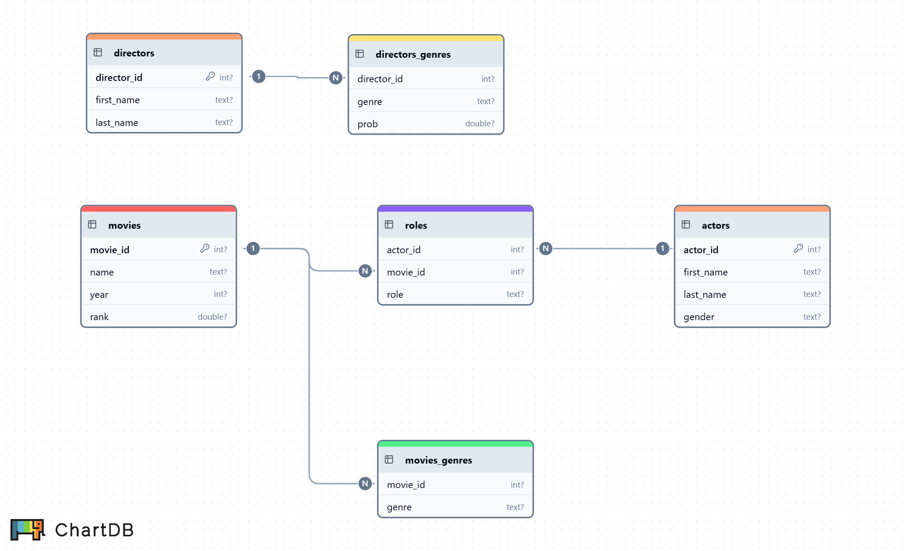

# Movie database project
A **SQLite** database was built using **Go** from IMDB.com movie data.

The schema for the relational database is shown below:



## Running the project
To build the database locally, clone this repository (omitting the `movies.db` file) and run the executable `movies.exe` from the command line.  Please note that this program takes a long time (a couple of hours give or take) to run; you may wish to simply take the database file if that is what is of interest.  Alternatively, the files in the `data` folder can be temporarily moved somewhere else, leaving just one or two at a time to run.

## Project details
Using Go's [sqlite package](https://pkg.go.dev/modernc.org/sqlite), a SQLite database was built from the [IMDB.com](https://www.imdb.com/) data hosted by the [Northwestern University library](https://arch.library.northwestern.edu/concern/datasets/3484zh40n?locale=en).

### Data handling

**CSV data extraneous quotation marks**

In the source files `IMDB-movies.csv` whenever more than one movie with the same name was recorded in the same year, the title was saved in the CSV in a format like ` ..., "Aladdin" (1993-I)", ... ` instead of ` ..., "Aladdin (1993-I)", ..., ` with quotation marks only around the full title field.  This confused the CSV reading function.  This was cleaned by simply opening the file in Notepad++ and running a find/replace command once it was discovered this was happening hundreds of times.  The file saved in the `data` folder retains these adjustments.

For the source file `IMDB-roles.csv' this quotation mark problem was more complicated.  Several fields contained multiple quotation marks with interior commas; an example row was

```
35,2252,"(segment "Id")"
```

Since quotation marks immediately after commas or immediately before new lines can protect commas within role names, a regex find/replace was used, finding all instances of `(?<!,)"(?!\n)` and replacing with `'`.

**Single quotation marks**

Single quotation marks appearing anywhere in a text field were a problem for SQLite.  To remedy, all single quotation marks were replaced by the SQLite escape sequence `''` (two consecutive single quotation marks), followed by wrapping every field with single quotation marks.

## Possible enhancements and applications

**Director relationships**

Creating a table with links between movies and directors would add interesting possibilities to this project.

**Personal ratings**

In a system similar to [Letterboxd](https://letterboxd.com/), users could record their own reviews of movies, leading to recommendations for other movies to watch based on those reviews.

**Additional details**

For my own personal interest, add additional field in `movies` for filming locations would be fun.
